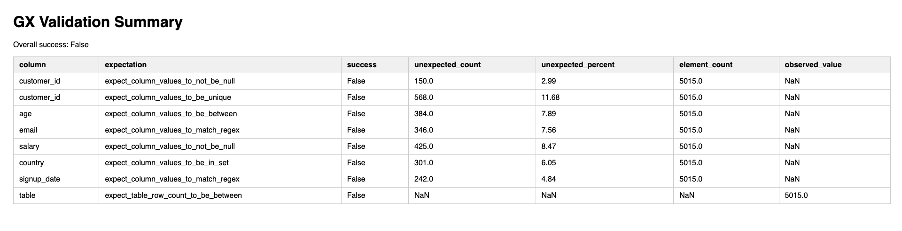
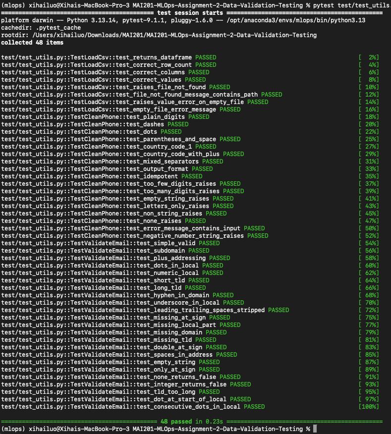

# Assignment 2 Report - Data Quality Validation & Unit Testing

**Dataset:** `customer_data.csv`

**Total rows validated:** 5,015

**Validation framework:** Great Expectations

**Testing framework:** pytest 9.1.1

**Overall GX validation result:** FAIL (0/8 expectations passed)

**Overall pytest result:** PASS (48/48 tests passed)

---

## 1. Great Expectations Validation Results

> 

---

## 2. Data Quality Issues Found

The table below summarises every failed expectation, the number of affected rows,
and the percentage of the dataset impacted.

| # | Column | Expectation | Affected Rows | % of Dataset | Status |
|---|--------|-------------|:-------------:|:------------:|:------:|
| 1 | `customer_id` | Must not be null | 150 | 2.99% | FAIL |
| 2 | `customer_id` | Must be unique | 568 | 11.68% | FAIL |
| 3 | `age` | Must be between 0 and 120 | 384 | 7.89% | FAIL |
| 4 | `email` | Must match valid email regex | 346 | 7.56% | FAIL |
| 5 | `salary` | Must not be null (>= 95% present) | 425 | 8.47% | FAIL |
| 6 | `country` | Must be one of: USA, Canada, UK, Australia | 301 | 6.05% | FAIL |
| 7 | `signup_date` | Must match date format `M/D/YYYY` | 242 | 4.84% | FAIL |
| 8 | Table | Row count must be between 500 and 1,000 | — | — | FAIL (observed: 5,015) |

### Issue descriptions

**`customer_id` — nulls (150 rows, 2.99%)**
150 records have no customer identifier at all. These rows cannot be
reliably joined to other tables or tracked across the pipeline.

**`customer_id` — duplicates (568 rows, 11.68%)**
Over one in ten rows shares a `customer_id` with at least one other row.
This suggests either data ingestion errors or repeated records from multiple
source systems being merged without deduplication.

**`age` - out of range (384 rows, 7.89%)**
Values outside [0, 120] were detected, including negative ages (e.g. `-25`)
and impossibly large values (e.g. `999`). These are likely data entry errors
or sentinel/placeholder values that were never filtered out.

**`email` - invalid format (346 rows, 7.56%)**
346 emails fail the regex `^[a-zA-Z0-9._%+\-]+@[a-zA-Z0-9.\-]+\.[a-zA-Z]{2,6}$`.
Examples include addresses with no local part (e.g. `@domain.com`) and
strings that are not email addresses at all.

**`salary` - missing values (425 rows, 8.47%)**
8.47% of rows have a null salary, exceeding the 5% tolerance set by
`mostly=0.95`. The expectation was intentionally lenient (salary is not
always mandatory), but the actual missingness rate is too high to meet
even that relaxed threshold.

**`country` - invalid values (301 rows, 6.05%)**
301 rows contain country values outside the allowed set
{`USA`, `Canada`, `UK`, `Australia`}. The most common violation observed
in the raw data is `India`, indicating the dataset contains customers from
regions not in scope for this analysis.

**`signup_date` - invalid format (242 rows, 4.84%)**
242 dates do not match the expected `M/D/YYYY` pattern. This may reflect
records from a different source system using an alternative date format
(e.g. `YYYY-MM-DD` or `DD/MM/YYYY`) or genuinely corrupt values.

**Row count - exceeds expected range**
The dataset contains 5,015 rows against an expected range of 500 - 1,000.
This is a schema-level concern: either the expectation bounds are
misconfigured, or a much larger data extract was supplied than intended.

---

## 3. Pytest Execution Results

> 

**Summary:** 48 tests across 3 test classes, all passing.

| Test class | Tests | Result |
|------------|:-----:|:------:|
| `TestLoadCsv` | 8 | PASS |
| `TestCleanPhone` | 17 | PASS |
| `TestValidateEmail` | 23 | PASS |
| **Total** | **48** | **PASS** |

---

## 4. Reflection - Which Data Quality Issue Would Most Impact ML Model Performance?

Of all the issues identified, **`age` out-of-range values (384 rows, 7.89%)**
would most severely impact ML model performance, for the following reasons.

### Why `age` is the highest risk issue

**Direct feature corruption.**
`age` is a continuous numeric feature that models consume directly during
training. Values like `-25` or `999` are not missing, but they are present and
will be treated as valid signal by any algorithm that does not explicitly
handle them. A `NaN` at least triggers imputation logic and whereas a corrupt value
silently poisons the learned distribution.

**Distortion of statistical summaries.**
A single value of `999` inflates the column mean and standard deviation
dramatically. After standard scaling (z-score normalisation), legitimate ages
like 70 or 80 get compressed toward zero while the outlier dominates the
range. This degrades every distance-based or gradient-based model that
relies on well-scaled inputs, e.g., KNN, SVM, neural networks, and Ridge
regression all suffer.

**Misleading learned boundaries.**
Tree-based models (Random Forest, XGBoost) will learn splits around the
corrupt values. A split at `age > 500` may appear to explain variance in
the training set but will never fire on real inference data, consuming
tree depth for no generalisation benefit.

**Comparison with other issues.**

| Issue | ML impact | Reason for lower rank |
|---|---|---|
| `customer_id` duplicates | Low | ID columns are typically dropped before training |
| `salary` nulls | Medium | Nulls are visible and handled by standard imputation |
| `country` invalid values | Low | Categorical; unknown labels are caught by encoder |
| `email` invalid format | Low | Email is rarely a training feature |
| `signup_date` format errors | Low | Parsing fails loudly, not silently |
